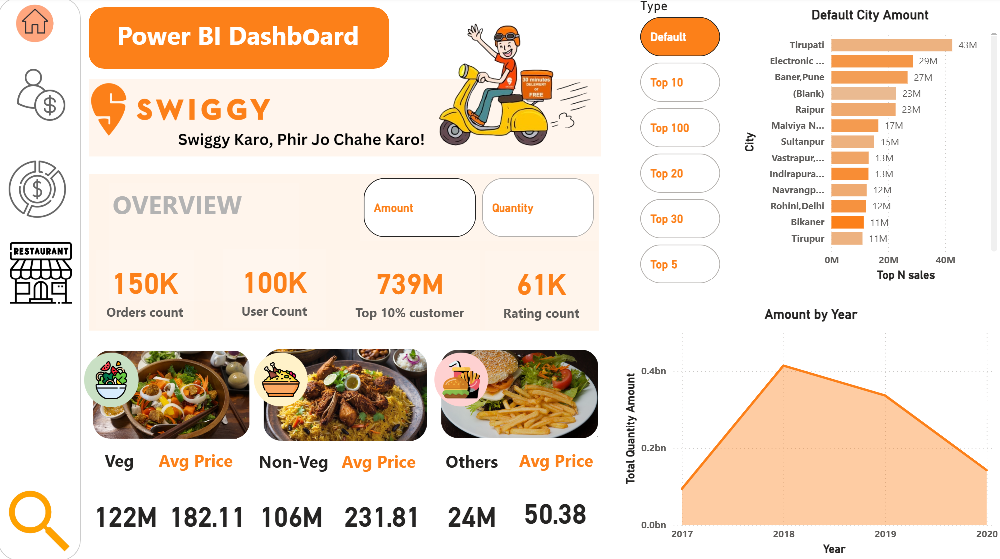
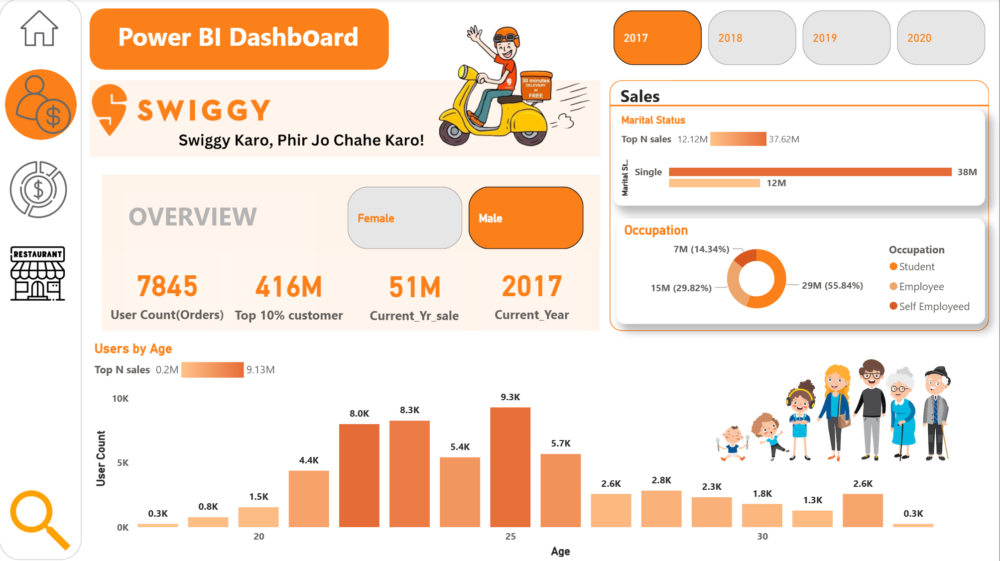
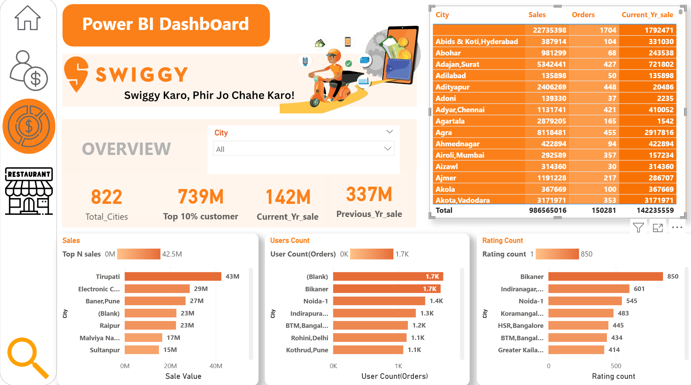
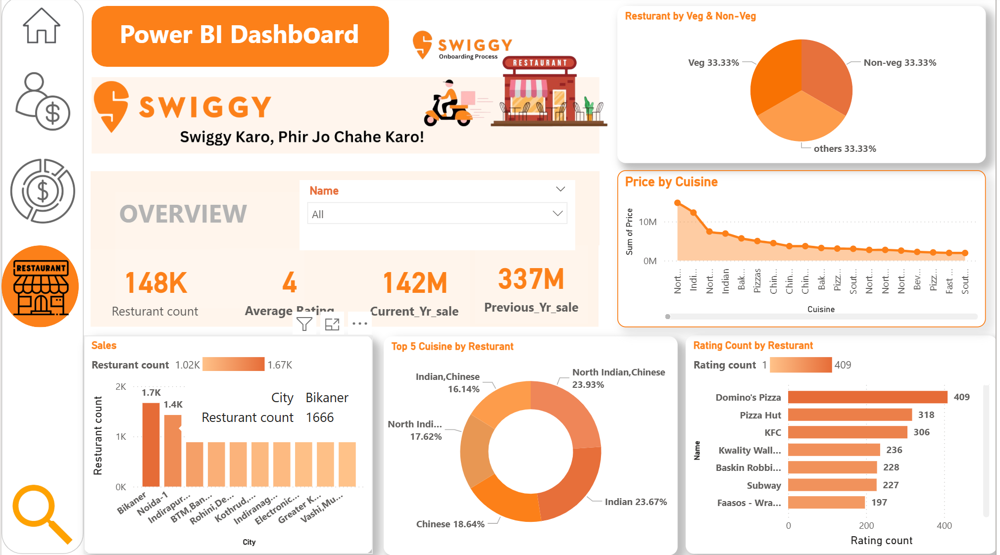
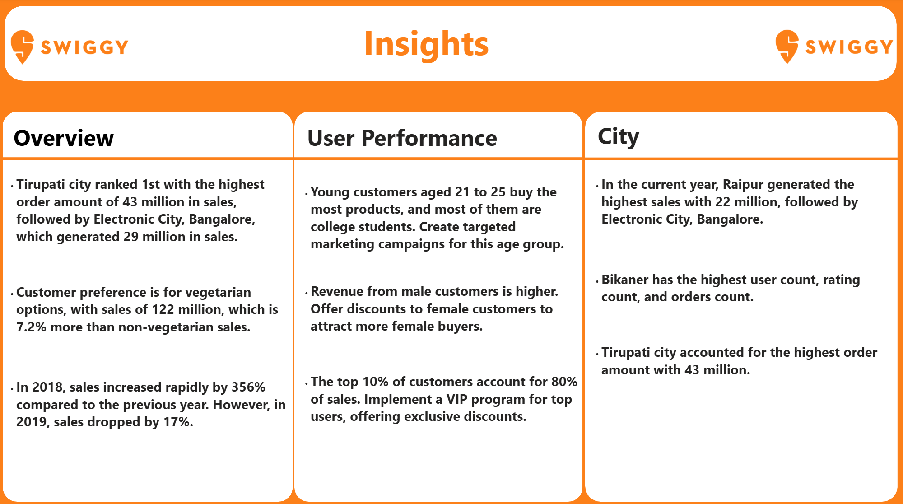

## 🍴 Swiggy Sales & Customer Insights – Power BI Dashboard
This Power BI project explores Swiggy’s sales, customer demographics, restaurant performance, and city-wise trends. The dashboard provides actionable insights into order volumes, revenue growth, customer behavior, and restaurant performance.

## 🎯 Project Objective
- To build an interactive analytics dashboard that enables Swiggy to:
- Track sales performance across years, cities, and cuisines.
- Analyze user behavior by age, gender, and marital status.
- Identify top-performing restaurants and cuisines.
- Monitor customer satisfaction through ratings.

  ## Dataset Used
 
 
 
 
  
## 📂 Dashboard Pages

## Key Insights

## 1️⃣ Sales Overview
KPIs: Orders Count, User Count, Top 10% Customer Contribution, Rating Count.
  
 Visuals:
- City-wise order amounts (Top N cities).
- Sales trend by year (2017–2020).
- Food category sales split (Veg, Non-Veg, Others) with average price comparison.

## 2️⃣ Customer Demographics
KPIs: User Orders, Sales by Top 10% Customers, Current Year Sales.

Visuals:
- Users by Age (highlighting 21–25 as highest contributors).
- Gender Split (Male vs Female).
- Marital Status contribution to sales (Single users dominate).
- Occupation breakdown (Students, Employees, Self-employed).

## 3️⃣ City & User Analysis
KPIs: Total Cities, Current Year Sales, Previous Year Sales.

Visuals:
- City-level sales, user counts, and rating counts.
- Ranking of cities by sales (Tirupati, Electronic City, Raipur as leaders).
- City-wise order and rating contribution.

## 4️⃣ Restaurant Performance
KPIs: Restaurant Count, Average Rating, Yearly Sales.

Visuals:
- Restaurant distribution by city.
- Cuisine-wise price contribution.
- Veg vs Non-Veg vs Others share.
- Top 5 cuisines (Indian, Chinese, North Indian dominate).
- Top restaurants by rating count (Domino’s Pizza, Pizza Hut, KFC).

## 5️⃣ Insights Page
Overview: Tirupati leads in sales (43M), Veg preference slightly higher than Non-Veg.

User Performance:
- Young customers (21–25) dominate.
- Male customers contribute higher revenue.
- Top 10% of customers account for ~80% of sales.

City Analysis:
- Raipur leads current-year sales, followed by Electronic City.
- Bikaner has the highest user count, order count, and rating count.

## 📊 Swiggy Dashboard – DAX Measures

## 1. Orders & Users
Total Orders = COUNTROWS(Orders)

Total Users = DISTINCTCOUNT(Users[UserID])

Top 10% Customer Contribution = 
CALCULATE(
    SUM(Sales[Amount]),
    TOPN(
        ROUNDUP(DIVIDE(COUNTROWS(Users),10,0),0),
        SUMMARIZE(Users, Users[UserID], "CustSales", SUM(Sales[Amount])),
        [CustSales],
        DESC
    )
)

## 2. Sales Performance
Total Sales = SUM(Sales[Amount])

Current Year Sales = 
CALCULATE(
    SUM(Sales[Amount]),
    YEAR(Sales[OrderDate]) = YEAR(TODAY())
)

Previous Year Sales = 
CALCULATE(
    SUM(Sales[Amount]),
    YEAR(Sales[OrderDate]) = YEAR(TODAY()) - 1
)

Sales Growth % = 
DIVIDE([Current Year Sales] - [Previous Year Sales], [Previous Year Sales], 0)

## 3. Food Category Metrics (Veg / Non-Veg / Others)
Total Veg Sales = 
CALCULATE(SUM(Sales[Amount]), Sales[FoodCategory] = "Veg")

Total NonVeg Sales = 
CALCULATE(SUM(Sales[Amount]), Sales[FoodCategory] = "Non-Veg")

Avg Price per Order = 
DIVIDE(SUM(Sales[Amount]), SUM(Sales[Quantity]))

## 4. Ratings & Feedback
Total Ratings = COUNT(Ratings[RatingID])

Avg Rating = AVERAGE(Ratings[Rating])

% of 5 Star Ratings = 
DIVIDE(
    CALCULATE(COUNTROWS(Ratings), Ratings[Rating] = 5),
    COUNTROWS(Ratings),
    0
)

## 5. City Analysis
City Wise Sales = 
SUMMARIZE(
    Cities,
    Cities[CityName],
    "TotalSales", SUM(Sales[Amount]),
    "Users", DISTINCTCOUNT(Users[UserID]),
    "Orders", COUNTROWS(Orders),
    "Ratings", COUNTROWS(Ratings)
)

## 6. Restaurant Performance
Total Restaurants = DISTINCTCOUNT(Restaurants[RestaurantID])

Top Restaurant by Rating = 
TOPN(
    1,
    SUMMARIZE(Restaurants, Restauran

## ⚠️ Challenges Faced
- Cleaning city and restaurant names (duplicate spellings, blanks).
- Handling skewed sales data (top cities/users contributing heavily).
- Designing interactive Top N filters for flexible city ranking.
- Managing a multi-page navigation flow with clear storytelling.

## ✅ Conclusion
- The Swiggy Power BI Dashboard delivers a holistic view of sales, users, and restaurants, highlighting:
- Customer concentration (young, male, student segment).
- Key growth-driving cities (Tirupati, Electronic City, Raipur).
- Restaurant performance leaders (Domino’s, Pizza Hut, KFC).
- Importance of loyalty among top 10% customers.
